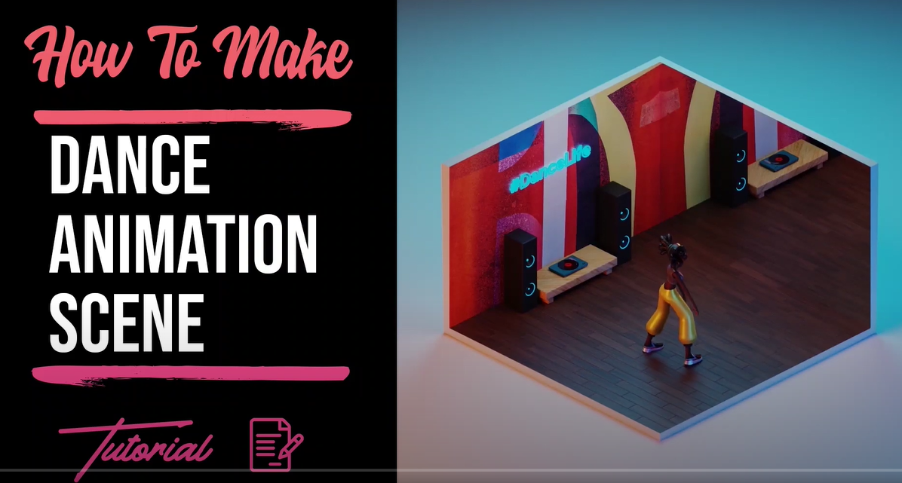

# Augmented Reality Cube Dance
Vuforia version: add-vuforia-package-9-7-5  
Unity version: 2019.4.20f1   
Author: Gan Ting Yu
Contact: gantingyu@gmail.com

# Extra Notes:
1) "Paint.net" software <- To resize image into 280x280px.   
2) "3dthis.com" <- To make the printable 3d cube.   
3) 3D Model Used: Unity Asset Store -> AcquireChan(free)   

# To see things inside a cuboid:
1) I'm using "blender" software, invert the cube's normal from outside towards inside.
2) After invert plane normal, export cube into ".fbx" format.
3) Import the .fbx model into unity.
4) At Unity's Project panel-> right click-> Create-> Material.
5) Click on the newly create material-> Inspector-> Change rendering mode into: "Fade" + Change color's alpha value to zero-> Done.
6) Drag the material into: MultiTarget-> ChildTargets-> Mask Out Behaviour (Script)-> Mask Material (all six faces of the cube).
7) Done, probably will make a video for this maybeee.

# How to upload unity+vuforia project to github:
1) Cr8 new repo at github, include .ignore unity.  
2) In the .ignore, remove backslashes "/".  
3) Using "github desktop" software downloaded; clone repo to desktop and drag unity folder into it.  
4) Git commit then push.  
5) Done.

# Future plans:
1) Add cube surroundings  

